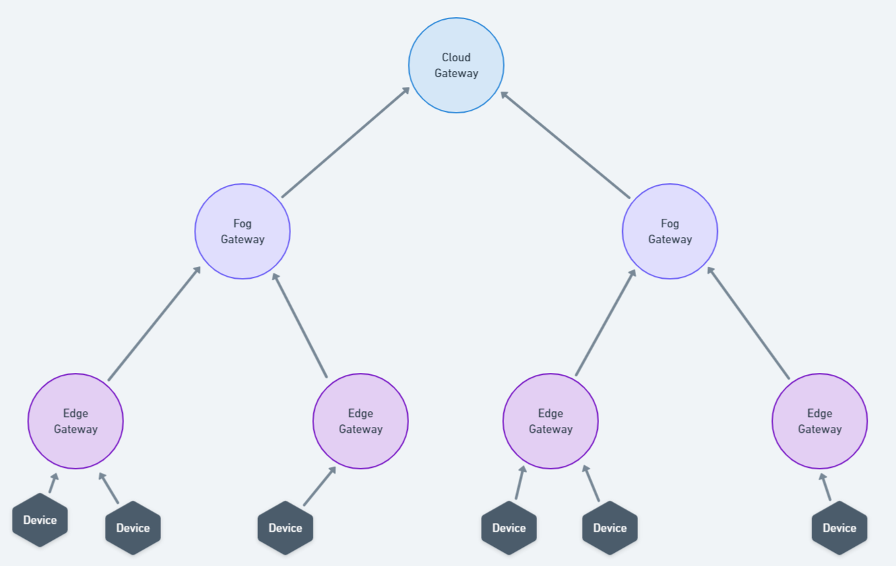

# soft-iot-dlt-cloud-broker

O `soft-iot-dlt-cloud-broker` é o _bundle_ genérico que atua na camada _Cloud_. Ele responsável por requisitar e realizar o cálculo de [Top-K](https://www.sciencedirect.com/science/article/abs/pii/S002002551830714X#:~:text=A%20Top-k%20retrieval%20algorithm%20returns%20the%20k%20best%20answers,take%20into%20consideration%20execution%20time.) dos dispositivos. <br/>
Para a comunicação, é utilizado o protocolo MQTT.

### Modelo da arquitetura

<p align="center">
  
</p>

## Configurações

| Propriedade      | Descrição                                                          | Valor Padrão                                  |
| ---------------- | ------------------------------------------------------------------ | --------------------------------------------- |
| ip_up            | Endereço IP do _Client_ situado na camada acima                    | localhost                                     |
| ip               | Endereço IP de onde o _Bundle_ está sendo executado                | localhost                                     |
| port             | Porta para conexão com o _Broker_                                  | 1883                                          |
| user             | Usuário para conexão com o _Broker_                                | karaf                                         |
| pass             | Senha para conexão com o _Broker_                                  | karaf                                         |
| deviceAPIAddress | URL da API onde estão os dispositivos                              | http://localhost:8181/cxf/iot-service/devices |
| hasNodes         | Se o gateway onde o bundle está sendo executado irá possuir filhos | true                                          |
| timeoutInSeconds | Tempo máximo de espera da resposta dos filhos                      | 30                                            |
| debugModeValue   | Modo depuração                                                     | true                                          |

## Protocolo TopKP

<details>
<summary><h3>Requisita os Top-Ks dispositivos:</h3></summary>

**Requisição:**

```powershell
GET topk {
    "id": "requestId",
    "k": value,
    "functionHealth": [
        {
            "sensor": "sensorType1",
            "weight": value
        },
        {
            "sensor": "sensorType2",
            "weight": value
        },
        {
            "sensor": "sensorType3",
            "weight": "value
        },
    ]
}
```

**Resposta**

```powershell
{
    "id": "responseId",
    "timestamp": "currentTime",
    "devices": [
        {
            "deviceId": "deviceId1",
            "score": value
        },
        {
            "deviceId": "deviceId2",
            "score": value
        },
    ]
}
```

</details>

## Requisições através do [Mosquitto](https://mosquitto.org/) _MQTT Broker_

### Requisita os Top-Ks dispositivos

```powershell
mosquitto_sub -t "TOP_K_HEALTH_FOG_RES/#" -u <USER> -P <PASSWORD> -h <HOST_NAME> -p <PORT>
```

```powershell
mosquitto_pub -t "GET topk" -m '{"id": value,"k": value,"functionHealth": [{"sensor": "sensorType1","weight": value},{"sensor": "sensorType2","weight": value}]}' -u <USER> -P <PASSWORD> -h <HOST_NAME> -p <PORT>
```
